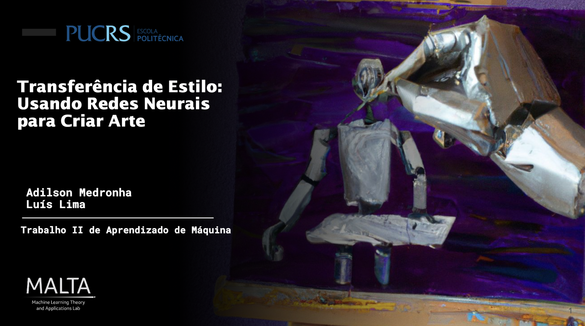

# Desenvolvimento para o Trabalho II da disciplina de Aprendizado de Máquina, PUCRS.

# train
python src/neural_style.py train --dataset <dataset path> --style-image images/style_to_train/sketch1.jpg --save-model-dir models/ --epochs 2 --cuda 0

# eval
streamlit run src/main.py

